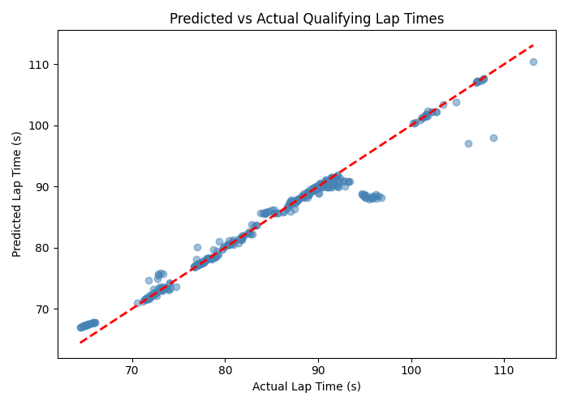
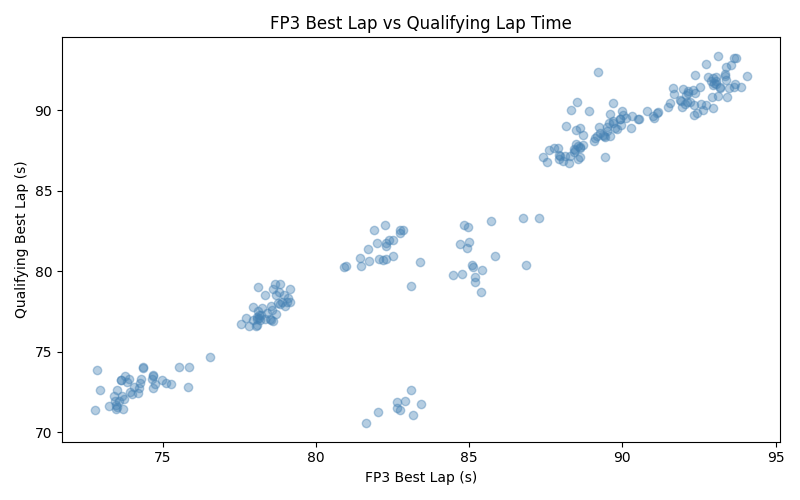
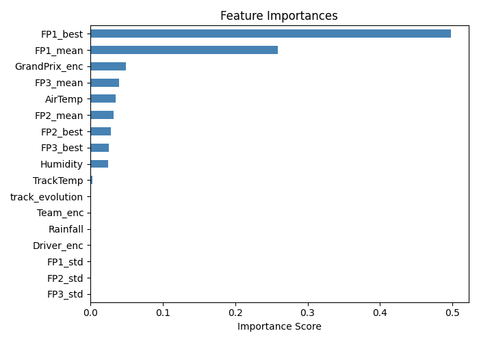
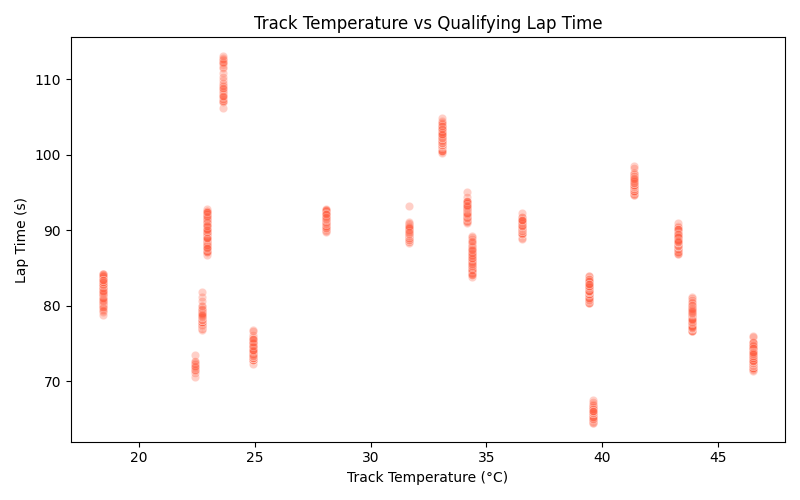

# 🏎️ F1 Qualifying Lap Time Predictor

> Predicting Formula 1 qualifying lap times using real practice session 
> telemetry, weather data, and machine learning.

---

##  Overview
This project builds an end-to-end machine learning pipeline that predicts 
a driver's best qualifying lap time based on practice session data (FP1, FP2, FP3) 
and race weekend conditions like track temperature and humidity.

---

##  Problem Statement
Can we predict a driver's qualifying lap time using only data available 
**before** qualifying begins? (Practice sessions + weather conditions)

---

##  Model Results

| Model | MAE | R² |
|-------|-----|-----|
| Ridge | 7.683s | -0.03 |
| Random Forest | 3.709s | 0.64 |
| Gradient Boosting | 3.953s | 0.64 |

 **Best Model: Random Forest** with MAE of 3.709 seconds

---

## 🔍 Key Findings
- **FP1 best lap time** is the strongest predictor of qualifying pace
- The **circuit identity** is the 3rd most important feature
- Weather features like air temp and humidity have moderate influence
- Lap time consistency (std) within a session has very little predictive power

---

##  Visualizations

### Predicted vs Actual Qualifying Lap Times


### FP3 Best Lap vs Qualifying Lap Time


### Feature Importances


### Track Temperature vs Lap Time


---

##  Project Structure
```
f1-quali-predictor/
├── data/
│   ├── raw/               # Raw FastF1 session data
│   └── processed/         # Feature engineered data
├── notebooks/
│   ├── 01_data_collection.ipynb
│   ├── 02_eda.ipynb
│   ├── 03_feature_engineering.ipynb
│   ├── 04_modeling.ipynb
│   └── 05_evaluation.ipynb
├── src/                   # Modular Python scripts
├── app/
│   └── streamlit_app.py   # Live demo app
├── models/                # Saved model and encoders
├── assets/                # Charts and visualizations
└── README.md
```

---

## ⚙️ How to Run

### 1. Clone the repo
```bash
git clone https://github.com/harshini752/f1-quali-predictor.git
cd f1-quali-predictor
```

### 2. Create virtual environment
```bash
python3 -m venv venv
source venv/bin/activate
```

### 3. Install dependencies
```bash
pip install -r requirements.txt
```

### 4. Run the Streamlit app
```bash
streamlit run app/streamlit_app.py
```

---

##  Tech Stack
- **Data:** FastF1, Pandas, NumPy
- **Modeling:** Scikit-learn (Random Forest, GBM, Ridge)
- **Visualization:** Matplotlib, Seaborn
- **App:** Streamlit
- **Tracking:** MLflow
- **Language:** Python 3.13

---

##  Future Improvements
- Add 2022 and 2024 seasons for more training data
- Integrate XGBoost and LightGBM once Python 3.13 compatibility improves
- Add tyre compound as a feature
- Connect to OpenF1 API for real-time predictions
- Deploy on Streamlit Cloud for public access

---

## Contributing

Feel free to fork this project and submit pull requests. Contributions are always welcome!

---

## License

This project is open-source and available for use.

---

## Contact

For questions or suggestions, feel free to reach out:

 **harshiniratnakumar@gmail.com**
