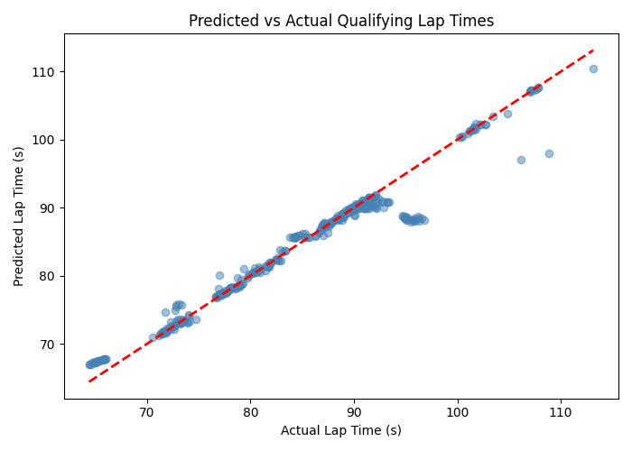
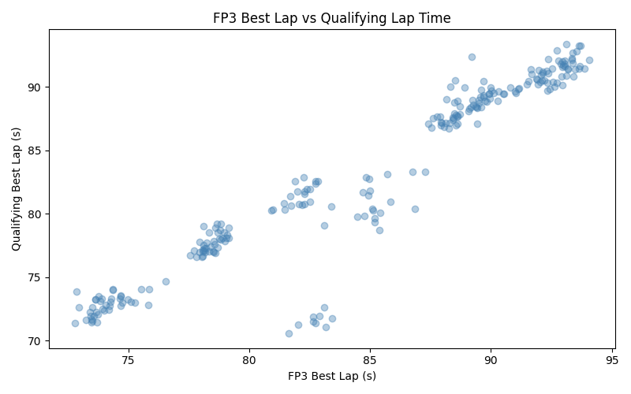
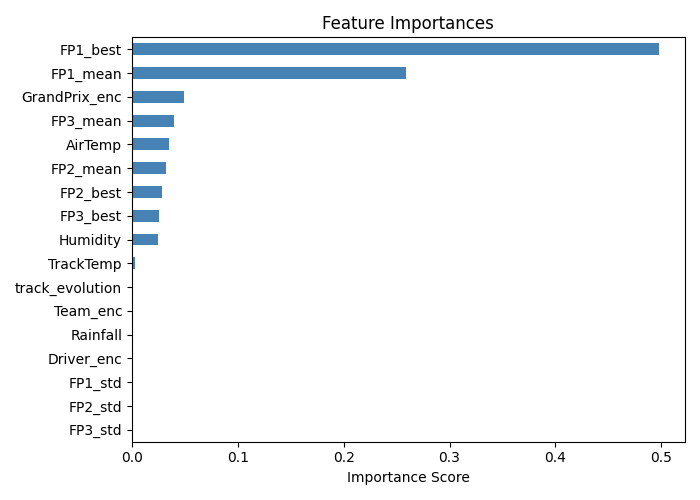
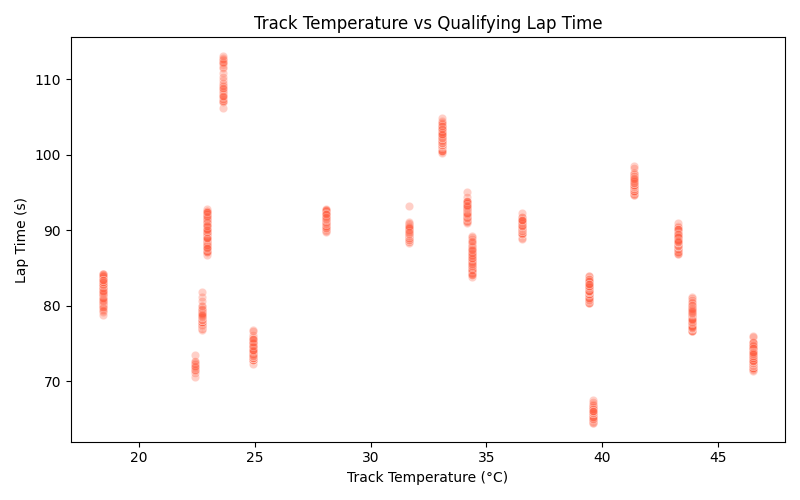

# 🏎️ F1 Qualifying Lap Time Predictor

🚀 **Live Demo:** [https://f1-quali-predictor.streamlit.app](https://f1-quali-predictor.streamlit.app)

> End-to-end ML pipeline: FastF1 ingestion → BigQuery data warehouse → dbt transformations (16 tests) → Random Forest/XGBoost model → live Streamlit app

---

##  Overview
This project builds an end-to-end machine learning pipeline that predicts 
a driver's best qualifying lap time based on practice session data (FP1, FP2, FP3) 
and race weekend conditions like track temperature and humidity.

---

##  Problem Statement
Can we predict a driver's qualifying lap time using only data available 
**before** qualifying begins? (Practice sessions + weather conditions)

---

##  Model Results

| Model | MAE | R² |
|-------|-----|-----|
| Ridge | 7.683s | -0.03 |
| Random Forest | 3.709s | 0.64 |
| Gradient Boosting | 3.953s | 0.64 |

 **Best Model: Random Forest** with MAE of 3.709 seconds

### What does 3.7s MAE mean in practice?

The average F1 qualifying lap time across all 2023 circuits is **84.8 seconds**, so:

- **3.7s MAE ≈ 4.4% of average lap time** — roughly the gap between P1 and P8–P10 in a typical qualifying session
- A naive baseline (always predicting the training-set mean of 84.1s) achieves MAE of **9.47s (11.2%)**
- Random Forest is **60.8% more accurate** than this naive baseline, confirming the model captures real structure in the data

---

## 🔍 Key Findings
- **FP1 best lap time** is the strongest predictor of qualifying pace
- The **circuit identity** is the 3rd most important feature
- Weather features like air temp and humidity have moderate influence
- Lap time consistency (std) within a session has very little predictive power

---

##  Visualizations

### Predicted vs Actual Qualifying Lap Times


### FP3 Best Lap vs Qualifying Lap Time


### Feature Importances


### Track Temperature vs Lap Time


---

##  Project Structure
```
f1-quali-predictor/
├── data/
│   ├── raw/                   # Raw FastF1 session data
│   └── processed/             # Feature engineered data
├── src/                       # Modular Python pipeline
│   ├── data_loader.py         # FastF1 session fetching
│   ├── data_pipeline.py       # End-to-end data collection script
│   ├── features.py            # Feature engineering
│   ├── model.py               # Model definitions (RF, GBM, Ridge, XGBoost)
│   ├── train.py               # Training + artefact saving
│   └── predict.py             # Inference helpers
├── pipeline/                  # BigQuery data loading scripts
│   ├── load_to_bigquery.py    # Loads CSV data into BigQuery
│   └── requirements-pipeline.txt  # BigQuery + dbt dependencies
├── dbt_f1/                    # dbt models and tests (staging + marts)
│   ├── dbt_project.yml
│   ├── profiles.yml
│   └── models/
│       ├── staging/
│       │   ├── stg_lap_times.sql      # Cleaned per-lap records
│       │   └── stg_pit_stops.sql      # Derived pit stop events
│       └── marts/
│           └── mart_qualifying_results.sql  # Qualifying summary with grid positions
├── app/
│   └── streamlit_app.py       # Live demo app
├── tests/
│   └── test_feature_engineering.py  # Pytest unit tests for src/features.py
├── models/                    # Saved model artefacts and label encoders
├── assets/                    # Charts and visualizations
├── 01_data_collection.ipynb
├── 02_eda.ipynb
├── 03_feature_engineering.ipynb
├── 04_modeling.ipynb
├── 05_evaluation.ipynb
├── config.yaml                # Central pipeline and model configuration
├── Dockerfile
├── docker-compose.yml
└── requirements.txt
```

---

## ⚙️ How to Run

### 1. Clone the repo
```bash
git clone https://github.com/harshini752/f1-quali-predictor.git
cd f1-quali-predictor
```

### 2. Create virtual environment
```bash
python3 -m venv venv
source venv/bin/activate
```

### 3. Install dependencies
```bash
pip install -r requirements.txt
```

### 4. Run the Streamlit app
```bash
streamlit run app/streamlit_app.py
```

---

## BigQuery + dbt Pipeline

This layer loads the raw and processed F1 data into BigQuery and transforms it
with dbt into clean staging views and an analytics-ready qualifying mart.

### Architecture

```
data/raw/all_sessions.csv        ──┐
                                   ├─► BigQuery (f1_data dataset)
data/processed/features.csv      ──┘       │
                                           ├── raw_lap_times
                                           └── qualifying_features
                                                    │
                                               dbt (f1_dbt)
                                                    │
                                      ┌─────────────┴──────────────┐
                                      │                            │
                               stg_lap_times              mart_qualifying_results
                               stg_pit_stops
```

### Setup

#### 1. Install pipeline dependencies
```bash
pip install -r pipeline/requirements-pipeline.txt
```

#### 2. Place your service-account credentials
Copy your GCP service account key to the project root as `gcp_credentials.json`
(it is already in `.gitignore`). The script reads `project_id` directly from the
JSON, so no extra configuration is needed.

#### 3. Load data into BigQuery
```bash
python pipeline/load_to_bigquery.py
```

This creates the `f1_data` dataset (if it does not exist) and writes two tables:

| Table | Source file | Rows (approx.) |
|-------|-------------|-----------------|
| `raw_lap_times` | `data/raw/all_sessions.csv` | ~150 k laps |
| `qualifying_features` | `data/processed/features.csv` | ~600 driver-race rows |

Timing columns (`LapTime`, `Sector1Time`, etc.) are converted from pandas
timedelta strings to **float seconds** before loading.

#### 4. Configure dbt
Edit `dbt_f1/profiles.yml` and set your actual GCP project ID:
```yaml
project: my-first-project   # ← replace with your project ID
```

#### 5. Run dbt models
```bash
cd dbt_f1
dbt run --profiles-dir .
dbt test --profiles-dir .
```

#### dbt models

| Model | Type | Description |
|-------|------|-------------|
| `stg_lap_times` | View | Cleaned per-lap records — accurate laps only, all timing in seconds |
| `stg_pit_stops` | View | Pit stop events with compound change and duration in seconds |
| `mart_qualifying_results` | Table | One row per driver per race: grid position, gap to pole, FP→quali deltas |

---

##  Tech Stack
- **Data:** FastF1, Pandas, NumPy
- **Modeling:** Scikit-learn (Random Forest, GBM, Ridge), XGBoost
- **Visualization:** Matplotlib, Seaborn
- **App:** Streamlit
- **Testing:** Pytest
- **Tracking:** MLflow
- **Warehouse:** Google BigQuery — data warehouse
- **Transformation:** dbt — data transformation and testing
- **Infrastructure:** Google Cloud, Docker
- **Language:** Python 3.13

---

##  Future Improvements
- Connect to OpenF1 API for real-time pre-qualifying predictions
- Add LightGBM model comparison
- Expand dbt mart with sector-level and tyre degradation analytics
- Add CI pipeline to run pytest + dbt tests on push

---

## Contributing

Feel free to fork this project and submit pull requests. Contributions are always welcome!

---

## License

This project is open-source and available for use.

---

## Contact

For questions or suggestions, feel free to reach out:

 **harshiniratnakumar@gmail.com**
1